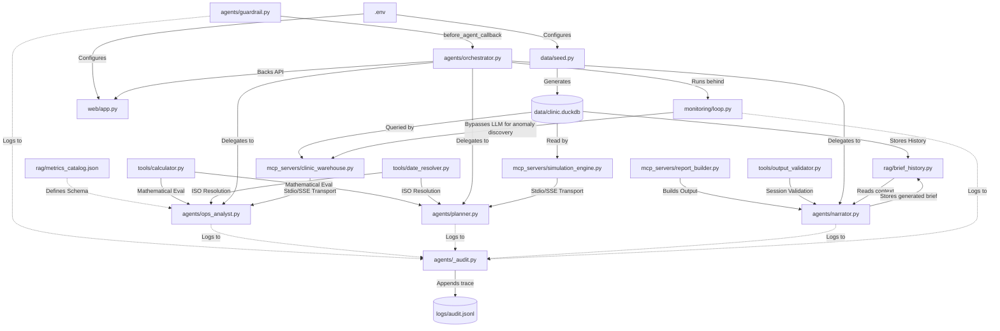

# Project Knowledge Graph & AI Handover Guide

This document maps the entire project structure, relationships, constraints, and dependencies into a structured Knowledge Graph format (Mermaid + JSON-LD spec) so that any subsequent AI agent (e.g., Claude Code, Cursor, Aider) can instantly context-load the codebase and resume development without losing context.

---

## 1. Handover Prompt (Copy-Paste to Next AI)

Copy and paste the following prompt directly into your new AI agent's chat interface when starting a new session in this workspace:

```text
You are onboarding as the new lead AI developer for the "Clinic Operations Copilot" project. 
To bootstrap your understanding of the workspace, architecture, rules, and current build status, please read:
1. `HANDOVER_KG.md` (specifically the Knowledge Graph metadata)
2. `GOAL.md` (for the functional scope)
3. `CONSTITUTION.md` (for the non-negotiable compliance rules)
4. `SKILL.md` (for the sequential build order and verification protocol)
5. `STATE.md` (for the current implementation checklist)
6. `PLAN.md` (for exact file paths, signatures, tests, and PASS criteria)

Ensure that you:
- Adhere strictly to the "Ponytail" minimalist code rules (YAGNI, stdlib first, no redundant abstractions).
- Run the verifier tests after implementing any component before checking it off in STATE.md.
- Maintain the exact file organization and database schemas defined in the Handover Knowledge Graph.
```

---

## 2. Knowledge Graph Visualization

This visual model defines the architectural components, their relationships, and data flow.



---

## 3. Structural Graph Schema (JSON-LD Node Mapping)

Below is the semantic schema mapping all components. This allows LLMs with structured JSON parsers to consume the architecture directly.

```json
{
  "@context": "https://schema.org",
  "@graph": [
    {
      "@id": "file:///data/seed.py",
      "@type": "SoftwareSourceCode",
      "name": "Database Seed Generator",
      "description": "Generates synthetic clinic metrics, appointments, satisfaction surveys, and staffing datasets in DuckDB, embedding targeted operational anomalies.",
      "dependencies": ["file:///data/clinic.duckdb"],
      "verifiedBy": "file:///tests/test_data.py"
    },
    {
      "@id": "file:///mcp_servers/clinic_warehouse.py",
      "@type": "SoftwareApplication",
      "name": "Clinic Warehouse MCP Server",
      "description": "Exposes SQL query capabilities over DuckDB as MCP tools. Implements patient privacy aggregate guardrails.",
      "dependencies": ["file:///data/clinic.duckdb"],
      "verifiedBy": "file:///tests/test_mcp_clinic_warehouse.py"
    },
    {
      "@id": "file:///mcp_servers/simulation_engine.py",
      "@type": "SoftwareApplication",
      "name": "Simulation Engine MCP Server",
      "description": "Calculates projected improvements (SMS reminders, staffing headcount deltas) using linear baseline regressions.",
      "dependencies": ["file:///data/clinic.duckdb"],
      "verifiedBy": "file:///tests/test_mcp_simulation_engine.py"
    },
    {
      "@id": "file:///mcp_servers/report_builder.py",
      "@type": "SoftwareApplication",
      "name": "Report Builder MCP Server",
      "description": "Assembles raw briefs into markdown and standard HTML with standard non-diagnostic disclaimers.",
      "verifiedBy": "file:///tests/test_mcp_report_builder.py"
    },
    {
      "@id": "file:///tools/calculator.py",
      "@type": "SoftwareSourceCode",
      "name": "Validation Calculator Tool",
      "description": "Performs zero-eval mathematical computations using ast.literal_eval.",
      "verifiedBy": "file:///tests/test_tool_calculator.py"
    },
    {
      "@id": "file:///tools/date_resolver.py",
      "@type": "SoftwareSourceCode",
      "name": "Date Resolver Tool",
      "description": "Resolves natural-language ranges into concrete start/end ISO dates.",
      "verifiedBy": "file:///tests/test_tool_date_resolver.py"
    },
    {
      "@id": "file:///tools/output_validator.py",
      "@type": "SoftwareSourceCode",
      "name": "Output Fact Validator Tool",
      "description": "Verifies that all facts in a brief exactly trace back to query data retrieved during the current run.",
      "verifiedBy": "file:///tests/test_tool_output_validator.py"
    },
    {
      "@id": "file:///rag/metrics_catalog.json",
      "@type": "DigitalDocument",
      "name": "Metrics Definition Catalog",
      "description": "JSON definitions containing boundaries, categories, and metrics descriptions."
    },
    {
      "@id": "file:///rag/brief_history.py",
      "@type": "SoftwareSourceCode",
      "name": "Brief History Logger",
      "description": "Saves and retrieves historical briefs to maintain weekly brief continuity.",
      "dependencies": ["file:///data/clinic.duckdb"],
      "verifiedBy": "file:///tests/test_rag_brief_history.py"
    },
    {
      "@id": "file:///agents/guardrail.py",
      "@type": "IntelligentAgent",
      "name": "Guardrail Agent",
      "description": "Screens incoming user instructions. Blocks queries for individual clinical treatments or private patient data.",
      "dependencies": ["file:///agents/_audit.py"],
      "verifiedBy": "file:///tests/test_agent_guardrail.py"
    },
    {
      "@id": "file:///agents/ops_analyst.py",
      "@type": "IntelligentAgent",
      "name": "Ops Analyst Agent",
      "description": "Retrieves warehouse metrics, computes rates, resolves dates, and presents findings.",
      "dependencies": ["file:///mcp_servers/clinic_warehouse.py", "file:///tools/calculator.py", "file:///tools/date_resolver.py", "file:///rag/metrics_catalog.json", "file:///agents/_audit.py"],
      "verifiedBy": "file:///tests/test_agent_ops_analyst.py"
    },
    {
      "@id": "file:///agents/planner.py",
      "@type": "IntelligentAgent",
      "name": "Planner Agent",
      "description": "Fires operational simulations and reports projected improvements with a mandatory PROJECTED tag.",
      "dependencies": ["file:///mcp_servers/simulation_engine.py", "file:///tools/calculator.py", "file:///tools/date_resolver.py", "file:///agents/_audit.py"],
      "verifiedBy": "file:///tests/test_agent_planner.py"
    },
    {
      "@id": "file:///agents/narrator.py",
      "@type": "IntelligentAgent",
      "name": "Narrator Agent",
      "description": "Retrieves last 4 briefs, compares outputs, runs the validator, compiles markdown, and saves final outcomes.",
      "dependencies": ["file:///mcp_servers/report_builder.py", "file:///tools/output_validator.py", "file:///rag/brief_history.py", "file:///agents/_audit.py"],
      "verifiedBy": "file:///tests/test_agent_narrator.py"
    },
    {
      "@id": "file:///agents/orchestrator.py",
      "@type": "IntelligentAgent",
      "name": "Orchestrator Agent",
      "description": "Standard root conductor wireframe. Directs routing, sets guardrail callbacks, and initiates sessions.",
      "dependencies": ["file:///agents/guardrail.py", "file:///agents/ops_analyst.py", "file:///agents/planner.py", "file:///agents/narrator.py", "file:///agents/_audit.py"],
      "verifiedBy": "file:///tests/test_agent_orchestrator.py"
    },
    {
      "@id": "file:///monitoring/loop.py",
      "@type": "SoftwareApplication",
      "name": "Monitoring Background Loop",
      "description": "Periodically executes. Bypasses LLMs to scan SQL directly for utilization alerts, triggers agents only when anomalies are detected.",
      "dependencies": ["file:///agents/orchestrator.py", "file:///mcp_servers/clinic_warehouse.py"],
      "verifiedBy": "file:///tests/test_monitoring_loop.py"
    },
    {
      "@id": "file:///web/app.py",
      "@type": "WebApplication",
      "name": "FastAPI Portal",
      "description": "Serves a plain HTML, CSS-inlined dashboard showing chats, current briefs, and historical audit entries.",
      "dependencies": ["file:///agents/orchestrator.py", "file:///rag/brief_history.py"],
      "verifiedBy": "file:///tests/test_e2e.py"
    }
  ]
}
```
