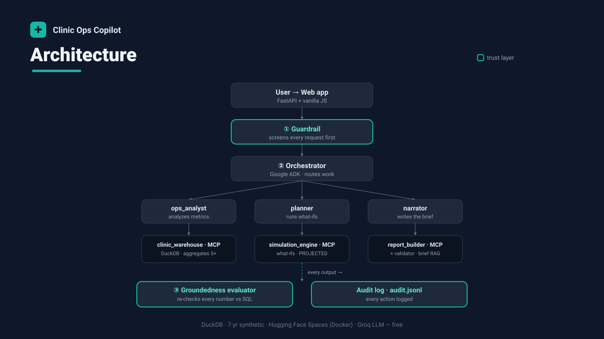

# Clinic Operations Copilot

### ▶ **[Live demo — try it now](https://huggingface.co/spaces/tanaygattani/clinical-ops-copilot)**

`https://huggingface.co/spaces/tanaygattani/clinical-ops-copilot`

**Track: Agents for Business.** Clinic Operations Copilot is auditable operational intelligence for a clinic network — an enterprise problem where business impact *and* trust both matter. Built with **Google ADK** (Agent Development Kit) and the **Model Context Protocol**, it turns a data warehouse into compliance-safe executive briefs that quantify the money: flagging utilization spikes, no-show patterns, wait-time outliers, and staffing gaps, then projecting the ROI of interventions before a dollar is spent.

Built as the capstone for Google's *5-Day AI Agents Intensive (Vibe Coding)* course.

## The problem

A regional manager runs a dozen clinics. The data to spot a problem — a clinic whose no-shows are climbing, a provider whose wait times are drifting — already exists, but it's buried across thousands of daily rows. The hard part isn't the query; it's turning the numbers into a trustworthy, decision-ready brief without leaking patient data or inventing figures.

## Why agents

This isn't one task, it's a pipeline of distinct jobs: **screen** the request for safety, **pull and compute** the metrics, **simulate** a fix, **write** it up in plain English, and **verify** every number before it ships. Each job has different constraints, so each is a separate agent — and because generator and evaluator are different agents, the system can check its own work instead of trusting it.

## What it does

- **Guardrail agent** screens every request first — no individual patient data, ever (aggregates of 5+ only).
- **Ops Analyst agent** (`ops_analyst`) queries the warehouse, resolves date ranges, computes rates.
- **Planner agent** (`planner`) runs what-if simulations, always labeled `PROJECTED`.
- **Narrator agent** (`narrator`) validates every number, compiles the brief, and appends a non-diagnostic disclaimer.
- **Groundedness evaluator** re-derives every figure in a brief against SQL truth (deterministic, no LLM) and scores it — a separate check, so the writer never grades itself.
- The web app surfaces a **live agent trace** and the groundedness score with each brief, and an **interactive simulator** to test interventions before spending a dollar.
- A **monitoring loop** scans SQL directly (zero API cost) and only wakes the agents when it finds an anomaly.
- A **FastAPI** web app serves the dashboard, executive briefs, the simulator, past briefs, and the audit trail — filterable by **clinic**, **year/quarter**, or a **custom date range**.

Data is 100% synthetic (`data/seed.py`) — **7 years** (2019–2025) across 12 clinics with seasonality, YoY growth, a 2020 COVID shock, and injected anomalies. No real patient data is used.

## Architecture



Every request enters through the **guardrail**; the **orchestrator** (Google ADK) routes work to the three specialist agents, each backed by its own **MCP tool server** over stdio; and every output is re-checked by the **groundedness evaluator** and written to an append-only **audit log**.

```
web/app.py ──► agents/orchestrator.py ──► guardrail (runs first)
                     │
                     ├─► ops_analyst  ──► mcp_servers/clinic_warehouse.py  (DuckDB · aggregates 5+)
                     ├─► planner      ──► mcp_servers/simulation_engine.py (what-ifs · PROJECTED)
                     └─► narrator     ──► mcp_servers/report_builder.py    (+ brief RAG)
                                          rag/brief_history.py  (past briefs)
tools/       calculator · date_resolver · output_validator · groundedness (verifies every number)
monitoring/  loop.py  (daily anomaly scan)
```

Compliance rules are enforced in code and listed in [CONSTITUTION.md](CONSTITUTION.md).

## Run locally

```bash
python -m venv .venv
.venv/Scripts/activate        # Windows;  source .venv/bin/activate on macOS/Linux
pip install .
cp .env.example .env          # then paste your free GROQ_API_KEY into .env (get one at console.groq.com/keys)
python data/seed.py           # builds data/clinic.duckdb
uvicorn web.app:app --reload  # open http://localhost:8000
```

Run the tests (they mock the LLM, so no API key needed):

```bash
pytest -q
```

## Deploy to Hugging Face Spaces (free, no credit card, no laptop needed)

Hugging Face Spaces hosts the Docker container for free and gives a public URL that runs without your machine on. This repo is already configured for it (the YAML header above sets `sdk: docker` and `app_port: 8080`).

1. Create a free account at [huggingface.co](https://huggingface.co).
2. **New → Space** → choose **Docker** → **Blank** template. Give it a name.
3. In the Space, go to **Settings → Variables and secrets → New secret** and add:
   - `GROQ_API_KEY` = your free key from [console.groq.com/keys](https://console.groq.com/keys)

   (The app defaults to Groq. To use Gemini instead, add a `LLM_PROVIDER=gemini` variable and a `GOOGLE_API_KEY` secret.)
4. Push this project to the Space's git repo (URL shown on the Space page):
   ```bash
   git init && git add . && git commit -m "Clinic Ops Copilot"
   git remote add space https://huggingface.co/spaces/tanaygattani/clinical-ops-copilot
   git push space main
   ```
5. Hugging Face builds the Dockerfile automatically and serves the app at your Space URL.

The container seeds its synthetic DB at startup into `/tmp` (writable, ephemeral) — no persistent storage needed.

## Secrets & git

`.env` holds your real key and is **git-ignored** — it never gets pushed. Only `.env.example` (a template with no real values) is committed. On Hugging Face the key comes from the Space **secret** `GROQ_API_KEY`, injected as an environment variable — never from a committed file. This satisfies Constitution Rule 7 (no secrets in code).
